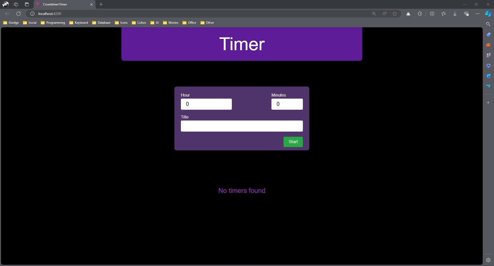

# Countdown Timer

**Countdown Timer** is a flexible web application that allows users to manage multiple countdown timers with features to start, pause, resume, and delete individual timers. It provides an intuitive interface for setting up and tracking tasks with customizable time durations and titles.

## Features

- **Timer Management**: Create, start, pause, resume, and delete multiple timers.
- **Customizable Timers**: Set hours, minutes, and titles for each timer.
- **Dynamic Updates**: Real-time countdown updates for active timers.
- **User Interface**: User-friendly interface for managing timers.
- **State Management**: Efficient state management for each timer’s status.
- **Angular Components**: Modular design using Angular components for scalability.

## Setting Up

To get started with this repository:

1. Clone the repository to your local machine.
   - `git clone https://github.com/dev-khaled-yousef/countdown-timer.git`

2. Install dependencies using npm.
   - `npm install`
   
   This will install all necessary packages and dependencies required for the Angular project.

3. Start the development server.
   - `npm start`
   
   This command will compile the application and open it in your default web browser. If it doesn't open automatically, you can navigate to [http://localhost:4200/](http://localhost:4200/) in your browser.

## Screenshots

Here are some screenshots of the application:

### Main Interface

### Timer Management

## Usage

- **Create New Timer**: Enter the hours, minutes, and title of the task, then click "Start" to create a new timer and begin the countdown.
- **Pause Timer**: Click the "Pause" button to halt the countdown.
- **Resume Timer**: Click the "Resume" button to continue the countdown from where it left off.
- **Delete Timer**: Click the "Delete" button to remove a timer from the list.

Feel free to contribute to the project by opening issues or submitting pull requests. For any queries, contact us at `khalidsliman2014@gmail.com`.
